::::::::::::::::::::::::::::::::::::::: objectives

- Create and switch between branches.
- Explain the purpose of `HEAD`.
- Merge changes from one branch into another.
- Use stashes to move unfinished work between branches.
- Resolve simple merge conflicts.
- Describe how pull requests support collaboration.

::::::::::::::::::::::::::::::::::::::::::::::::::

:::::::::::::::::::::::::::::::::::::::: questions

- How can I develop new features without disrupting my main work?
- How do teams combine work from multiple developers?

::::::::::::::::::::::::::::::::::::::::::::::::::

A **branch** is an independent line of development. Branches allow us to work
on changes separately and combine them later when they are ready.

Up to this point, we have made all our commits directly on the `main` branch.

This works well for small examples, but in practice we often want to work on bug fixes,
new ideas, or experiments without affecting the current version of
the project. This is very useful in both collaborative and solo development.

Recall that Git stores a history of commits. Each commit records the changes
(or *diff*) needed to move from one version of the project to another.

A branch is simply a name attached to a commit.

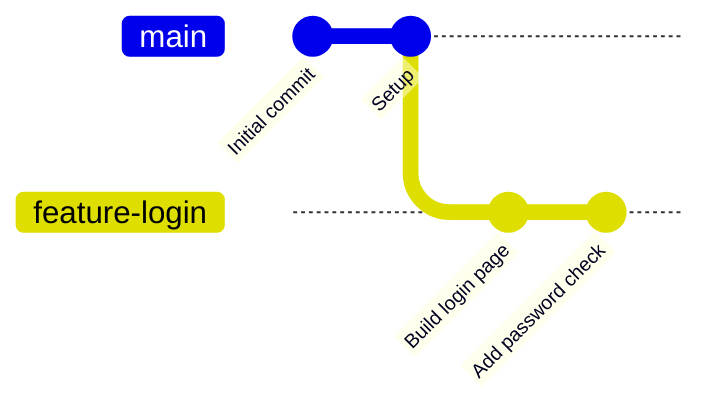

Git keeps track of the history of a branch by using the *reflog*.

::::::::::::::::::::::::::::::::::::::::: callout

## HEAD

Git keeps track of where you currently are using a special reference called
`HEAD`.

When you create a commit, Git adds that commit to the branch currently checked
out by `HEAD`.

A useful mental model is:

> `HEAD` is your current location in the repository history.

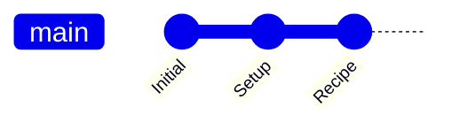

`HEAD` → `main` (i.e. the "Recipe" commit as this is the latest commit in the `main` branch.)

::::::::::::::::::::::::::::::::::::::::::::::::::

To see the branches in a repository:

```bash
$ git branch
```

```output
* main
```

The `*` shows the branch currently checked out by `HEAD`.

Create a new branch:

```bash
$ git branch feature
```

Switch to it:

```bash
$ git switch feature
```

```output
Switched to branch 'feature'
```

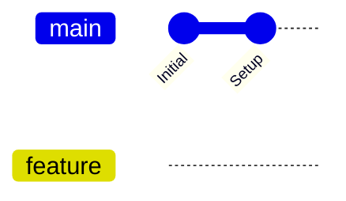

Check again:

```bash
$ git branch
```

```output
* feature
  main
```

Any commits we make now will be added to the `feature` branch.

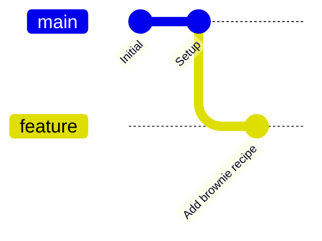

::::::::::::::::::::::::::::::::::::::::: callout

## Checkout and switch

Historically, Git used the command:

```bash
$ git checkout
```

for many different tasks.

Modern Git splits these responsibilities into two commands:

```bash
$ git switch
```

for moving between branches, and

```bash
$ git restore
```

for restoring file contents (you saw this earlier).

You will still see `git checkout` in older tutorials and online discussions.

::::::::::::::::::::::::::::::::::::::::::::::::::

Suppose we create a new file and commit it:

```bash
$ nano brownies.md
$ git add brownies.md
$ git commit -m "Add brownie recipe"
```

The new commit belongs only to the `feature` branch.

If we switch back to `main`:

```bash
$ git switch main
```

the file may disappear because it has not yet been merged.


This demonstrates an important idea:

> Branches allow us to isolate work until it is ready.

## Merging Branches

When the feature is complete, switch back to the branch that should receive the changes:

```bash
$ git switch main
```

Merge the feature branch:

```bash
$ git merge feature
```

Git combines the histories and updates `main`.

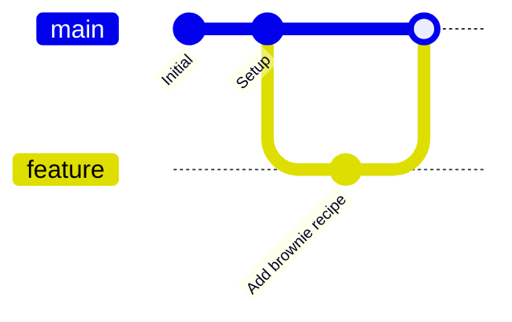

After merging, the feature branch can be deleted:

```bash
$ git branch -d feature
```

::::::::::::::::::::::::::::::::::::::::: callout

## Rebasing

Another way to combine histories is **rebase**.

Imagine someone adds commits to `main` while you are working on a feature
branch.

Instead of merging, you can replay your commits on top of the latest version
of `main`:

```bash
$ git rebase main
```

Before rebasing:

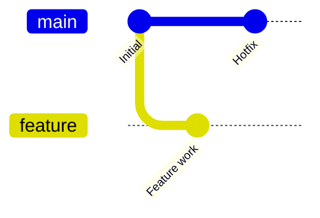

After:

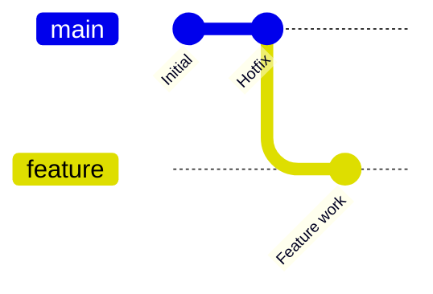
``

A useful way to think about rebase is:

> Merge joins two histories together. Rebase rewrites your branch so it looks like it started from a newer commit.

Many teams prefer feature branches to be rebased before they are merged because
this can produce a cleaner history.

If you are unsure whether to merge or rebase, use merge as you are less likely to accidentally lose work that way.

::::::::::::::::::::::::::::::::::::::::::::::::::

## Stashing Unfinished Work

Sometimes you realise you're working on the wrong branch.

You have changes, but they are not ready to commit.

Git can temporarily store those changes using a stash:

```bash
$ git stash
```

You can then switch branches:

```bash
$ git switch correct-branch
```

and restore the work:

```bash
$ git stash pop
```

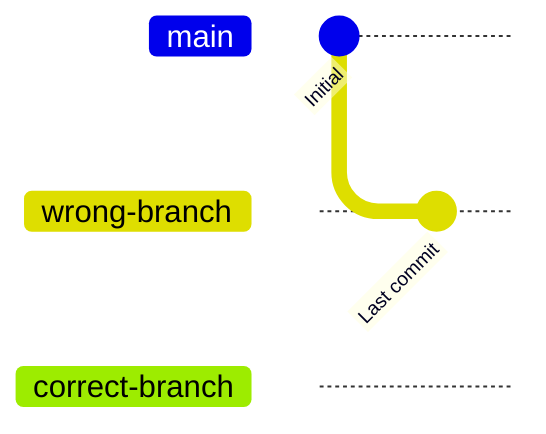

Think of a stash as a temporary shelf for unfinished work.

::::::::::::::::::::::::::::::::::::::::::::::::::

## Merge Conflicts

Sometimes two branches modify the same section of a file.

When Git cannot automatically decide which version to keep, it creates a
**merge conflict**.

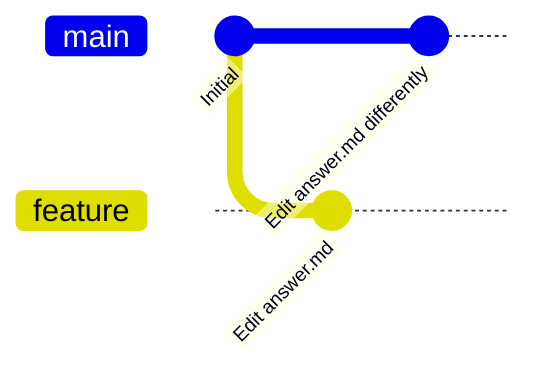

Attempting the merge might produce:

```bash
$ git merge feature
```

```output
CONFLICT (content): Merge conflict in answer.md
Automatic merge failed.
```

If you decide not to continue:

```bash
$ git merge --abort
```

This returns the repository to the state before the merge.

To finish the merge, open the conflict in the JupyterHub merge editor,
choose which changes to keep, save the file, and then:

```bash
$ git add answer.md
$ git commit
```

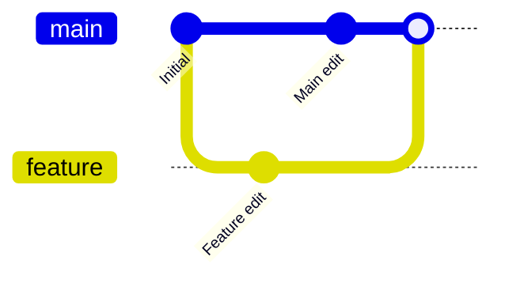

::::::::::::::::::::::::::::::::::::::::: callout

## Undoing a Local Merge

If you completed a merge and then realised it was a mistake, you can move back
to the previous commit:

```bash
$ git reset --hard HEAD~1
```

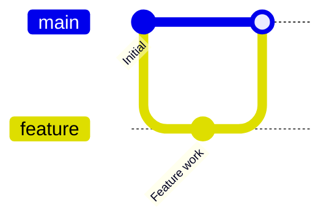

After the reset, `main` points back to the commit immediately before the merge.

This removes the most recent local commit, including a merge commit.

Be careful: `--hard` discards uncommitted changes.

::::::::::::::::::::::::::::::::::::::::::::::::::

## Pull Requests

Many projects do not merge directly into `main`.

Instead, the typical workflow is:

1. Create a branch.
2. Commit changes.
3. Push the branch to GitHub.
4. Open a Pull Request (or Merge Request on GitLab).
5. Review the changes.
6. Merge into `main`.

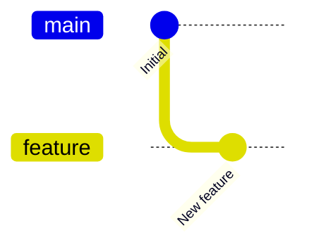

`feature` → Pull Request → review → merge into `main`

Pull Requests provide a place for discussion, review, and automated testing
before changes are merged.

::::::::::::::::::::::::::::::::::::::::::::::::::

::::::::::::::::::::::::::::::::::::::: challenge

## Mind Reading

Find a partner.

1. Clone the tutorial repository.
2. Create a repository in your own GitHub account.
3. Update `origin` so it points to your repository.
4. Answer the supplied question in `answer.md`.
5. Stage, commit, and push your answer.

Now switch roles:

6. Clone your partner's repository.
7. Read their answer.
8. Create `response.md` explaining what you think they meant.
9. Commit and push your response.

Return to your own repository:

10. Pull your partner's response.
11. Compare it with your original answer.
12. Confirm whether they understood correctly.

Finally:

13. Create a file called `secret-answer.txt`.
14. Use a `.gitignore` file so your partner never receives it.

::::::::::::::::::::::::::::::::::::::::::::::::::

::::::::::::::::::::::::::::::::::::::: challenge

## Commit to the Bit

Your instructor will provide a list of independent changes.

Examples might include:

- adding ingredients
- adding preparation steps
- fixing spelling mistakes
- adding cooking times
- adding serving sizes
- adding additional recipes

Complete as many changes as possible.

1. Create a feature branch.
2. Push it to GitHub.
3. Commit changes in logical units.
4. Merge the branch into `main`.

Try to create commits that tell a clear story of your work.

Fast learners may complete many small commits.

Others may focus on completing a single feature branch from start to finish.

::::::::::::::::::::::::::::::::::::::::::::::::::

::::::::::::::::::::::::::::::::::::::: challenge

## Stashing and Conflicts

### Part 1: Stashing

1. Create a new branch.
2. Start making changes.
3. Realise the work belongs on a different branch.
4. Do not commit.

Store the changes:

```bash
$ git stash
```

Switch branches:

```bash
$ git switch correct-branch
```

Restore the work:

```bash
$ git stash pop
```

Commit and merge the completed feature.

### Part 2: Merge Conflicts

Create a merge conflict by editing the same line on two branches.

Attempt a merge.

Abort it:

```bash
$ git merge --abort
```

Repeat the merge.

This time resolve the conflict using the JupyterHub merge editor.

Complete the merge.

### Part 3: Undo

After successfully merging:

```bash
$ git reset --hard HEAD~1
```

Inspect the history and confirm that the merge has been removed.

::::::::::::::::::::::::::::::::::::::::::::::::::

:::::::::::::::::::::::::::::::::::::::: keypoints

- Branches allow work to be developed independently from `main`.
- `HEAD` represents the current location in repository history.
- `git branch` lists and creates branches.
- `git switch` changes branches.
- `git merge` combines histories.
- `git rebase` replays commits onto a newer base.
- `git stash` temporarily stores unfinished work.
- `git merge --abort` cancels a failed merge.
- `git reset` can undo a local merge.
- Pull Requests are the standard workflow for reviewing and merging changes.

:::::::::::::::::::::::::