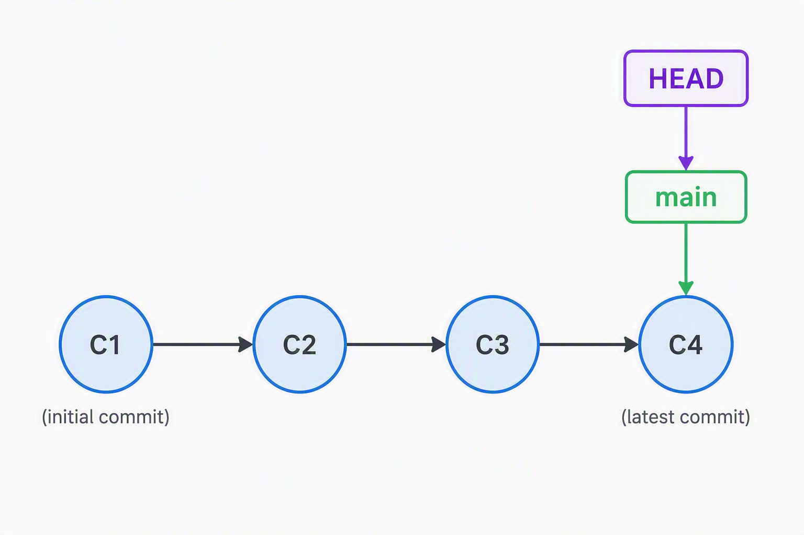

::::::::::::::::::::::::::::::::::::::: objectives

- Go through the modify-add-commit cycle for one or more files.
- Explain where information is stored at each stage of that cycle.
- Distinguish between descriptive and non-descriptive commit messages.

::::::::::::::::::::::::::::::::::::::::::::::::::

:::::::::::::::::::::::::::::::::::::::: questions

- How do I record changes in Git?
- How do I check the status of my version control repository?
- How do I record notes about what changes I made and why?

::::::::::::::::::::::::::::::::::::::::::::::::::

## Introduction

Once we have our respoitory set up, we can start making use of gits tracking features. To start with we can use the git status command.
Files in the repository directory are either tracked or untracked.
They are also unchanged relative to the last restore point (commit)
or modified.

Modified files are themselves either unstaged, meaning they have not been marked to be included in the next restore point ("commit"), or "staged" meaning they will be included in the next commit.

when we use git status, we can see which files are in each state.


Some files we never want to track. They could be files generated from tests or sensitive things we don't want to share. To keep them untracked, we lsit them in a `.gitignore` file, which tells git to ignore them. We usually create this file at the start of a repository and update it as we go along. When files which are listed in the `.gitignore` are modified, the changes won't be shown in `git status` and cannot be staged or committed unless forced with additional commands.

Making changes and tracking them in git follows a 3 step cycle:

### 1 Modify
- make a change like making a new file or editing a paragraph

### 2 Add

- tell git to bundle this modification as part of the next "save"
- multiple modifications or files can be added to this
- we call this bundle the "staging area". Files are "staged" if they are added
- only staged modifications can be part of a commit
   - if a file has been modified after it has been staged, the new modification has to be staged again to be included.

### 3 Commit

- tell git to save the set of modifications we previously added, and create a new restore point ("commit")
- a message is added to describe the logical change from the previous point
- the message is written as an imperative by convention eg. "add config file"

:::::::::::::::::::::::::::::::::::::::::::::::::::::::::::::::: callout
The idea of this cycle is that we should only create commits (restore points) for a minimal set of modifications that constitute a single self consistent logical change. Each commit is saved as the modifications to or difference between the current commit and the previous one. Once we commit, the staged changes are now just part of the current version, so the staging area is empty. A copy of the commited version is saved in the .git directory.

We can then build up our project using this cycle with a new commit each time we make a logical change. Each commit is labelled with the commit message and a hash code that uniquely identifies it. This builds what we call the "history": the chain of commits which describe each step we took to get to the current version. We can view this history using the log.



:::::::::::::::::::::::::::::::::::::::::::::::::::::::::::::::::::

## Undoing things

Making changes and creating commits can seem daunting at first. Its easy to mix up what files to add to a commit and mistakes happen all the time. We don't want these mistakes to also be saved indefinitely. The good news is that we can undo any of the steps in the cycle. 


within the modify, add, commit cycle, we can undo a modification to a file by resetting it to the previous restore point:

we can unstage a file while keeping the modification by doing git restore --staged --filename

this moves the modification out of the staging area and back to unstaged changes.

Finally if we are working locally we can undo the commit. This is called rewriting the history, and it is important that we only do this if the commit is local and hasn't been pushed to a remote, otherwise we risk permanently changing the history for everyone and affecting their work.

to undo the commit we can use git reset --soft to undo the act of the commit, but keeping the staging area
--mixed keeps the modifications but leaves them unstaged
--hard undoes all the modifications and returns the state back to the previous commit.


::::::::::::::::::::::::::::::::::::: challenge 

## Challenge 1: Git Tango

::: challenge
### Part 1: 2 steps forward one step back

Try creating a new file called git_tango.md

1. type in instructions like:

```output
# Git Tango
two steps forward
```

then use the git commands to track and stage the file.

confirm the change of state with `git status`

now unstage the file and confirm it again.

:::

:::: challenge
### Part 2: 3 steps forward

2. modify the file and add another instruction.
   - use the commands to stage the new changes
   - commit staged changes
   - confirm the changes with `git status` and `git log`

::::

::::: challenge
### Part 3: One step back
modify the file and add an incorrect instruction.
   - use the commands to stage and commit the error.
   - confirm the error with with `git status` and `git log`
   - undo the commit leaving modifications in the staging area
   - confirm the change
:::::
:::::: challenge
### Part 4: one step forward 2 steps back

   - commit again with a different message
   - confirm the change
   - undo the commit keeping modifcations but unstaged
   - confirm the change
::::::
::::::: challenge
### Part 5: three more steps forward
   - correct the instruction in the file and add and commit it
   - confirm the change

:::::::
:::::::: challenge
### Part 6: three steps back

   - completely undo the commit so its unchanged from 2.
   -confirm the change.

::::::::
:::::::::::::::::::::::: solution 
### part 1
use the commands `git add <file>` to stage a file
use `git status` to check it has been staged
use `git restore --staged <file>` to unstage the file
use `git status` to check it has been unstaged. 
::::::::::::::::::::::::
:::::::::::::::::::::::: solution
### part 2 

modify the file then use `git add <file>` and `git commit -m "commit message"` to add a commit
use `git status` and `git log` to check the commit has been added.
::::::::::::::::::::::::
:::::::::::::::::::::::: solution
### part 3

initially same as part 2
then to inverse use `git reset --soft`
::::::::::::::::::::::::
:::::::::::::::::::::::: solution
### part 4
use `git commit -m "new commit message"`
then to inverse and unstage `git reset --mixed`
::::::::::::::::::::::::
:::::::::::::::::::::::: solution
### part 5
same as part 2
::::::::::::::::::::::::
:::::::::::::::::::::::: solution
### part 6
use `git reset --hard`


:::::::::::::::::::::::::::::::::
:::::::::::::::::::::::::::::::::::::::::

Note that when using git reset to undo a commit, the same rule is applied to all the staged changes that were a part of that commit, similar to how a commit puts all the staged changes into a commit. This is different to how `git add <files>` and `git restore --staged <files>` apply to individual files. 


::::::::::::::::::::::::::::::::::::: keypoints 

- Check the current state using `git status` and `git log`
- make self consistent logical changes with the modify add commit cycle
- undo any part of this cycle using `git restore --staged` or `git reset --(soft, mixed, hard)` 


::::::::::::::::::::::::::::::::::::::::::::::::

